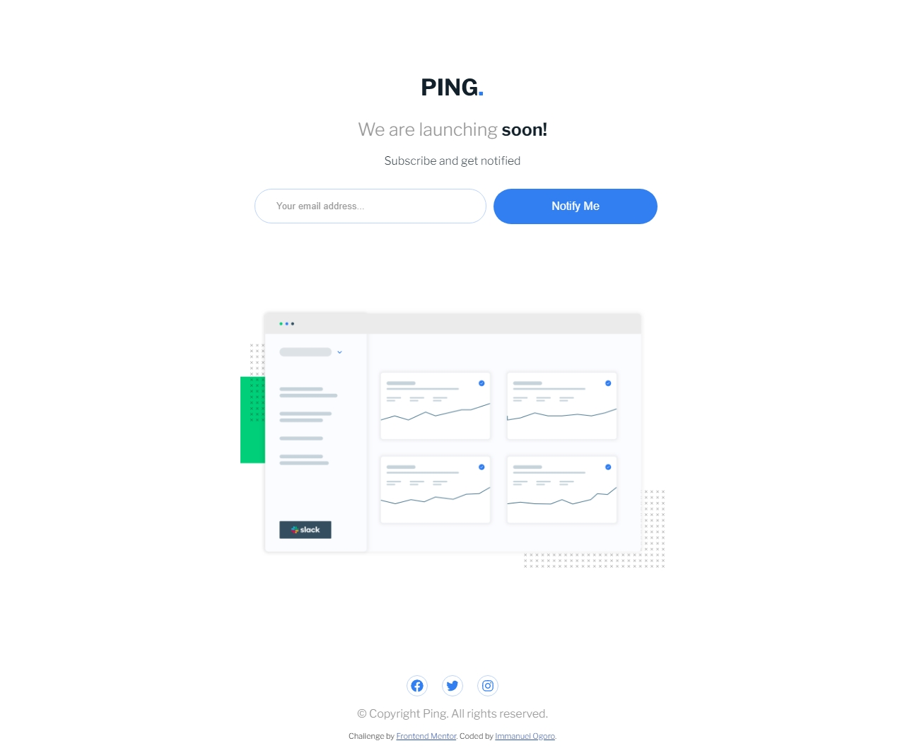

# Frontend Mentor - Ping coming soon page solution

This is a solution to the
[Ping coming soon page challenge on Frontend Mentor](https://www.frontendmentor.io/challenges/ping-single-column-coming-soon-page-5cadd051fec04111f7b848da).
Frontend Mentor challenges help you improve your coding skills by building realistic projects.

## Table of contents

- [Overview](#overview)
  - [The challenge](#the-challenge)
  - [Screenshot](#screenshot)
  - [Links](#links)
- [My process](#my-process)
  - [Built with](#built-with)
  - [What I learned](#what-i-learned)
  - [Continued development](#continued-development)
  - [Useful resources](#useful-resources)
- [Author](#author)
- [Acknowledgments](#acknowledgments)

**Note: Delete this note and update the table of contents based on what sections you keep.**

## Overview

### The challenge

Users should be able to:

- View the optimal layout for the site depending on their device's screen size
- See hover states for all interactive elements on the page
- Submit their email address using an `input` field
- Receive an error message when the `form` is submitted if:
  - The `input` field is empty. The message for this error should say _"Whoops! It looks like you forgot to add your
    email"_
  - The email address is not formatted correctly (i.e. a correct email address should have this structure:
    `name@host.tld`). The message for this error should say _"Please provide a valid email address"_

### Screenshot

### Links

- Solution URL: [Add solution URL here](https://your-solution-url.com)
- Live Site URL: [Add live site URL here](https://your-live-site-url.com)

## My process

### Built with

- Semantic HTML5 markup
- CSS custom properties
- Flexbox
- Mobile-first workflow -SASS -Animations

### What I learned

Well yeah i learnt how to do some basic email validation(Itwas more like pratice had an idea about done something
similar in the past), strengthen my layout skills cause the form section was kind of tricky in the desktop layout but i
figured it out while playing around with the firefox devtools also let me say the one thing that really made me love the
challenge is the javascript (The little logic and all). I also made sure to add some cool animation effects.

PS.Shinobi codes codekage Itachi Uchiha

### Continued development

Nothing for now

### Useful resources

1. To turn off input suggestions(little backstory) : You know i ran into a slight issue with the input for the email
   cause whenever i tried em filling my details it kept showing all nthis suggestions and i was like na i don't need
   these stuff so i hoped on to google and just searched how to stop a input link from showing suggestions and bam hit
   the spot this link right here g=hope it helps
   [https://stackoverflow.com/questions/43132693/how-to-turn-off-html-input-form-field-suggestions]

## Author

- Frontend Mentor - [@yourusername](https://www.frontendmentor.io/profile/yourusername)
